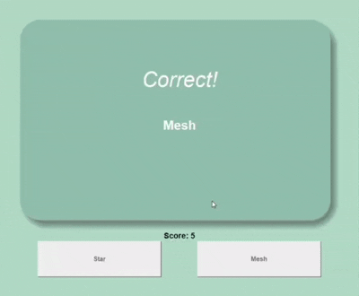

# 🎓 AI-Powered Flashcards from PPTX Syllabus

This project generates interactive flashcards using AI based on the content of a `.pptx` syllabus file. It uses Google's Gemini AI (via the `google-genai` package) to create quiz questions from the syllabus, and displays them in a simple GUI using Tkinter.

---

## 📁 Project Structure

```bash
flash_card_generator/
│
├── .env
├── .gitignore
├── flash_cards.py
├── main.py
├── question_generator.py
├── question_model.py
├── README.md
│
├── images/
│   ├── card_back.png
│   └── card_front.png
│
└── syllabus/
    └── example_syllabus.pptx
```

---

## 🚀 How It Works

1. **Extract Text**: Loads a `.pptx` file and extracts text from each slide.
2. **Generate Questions**: Sends the syllabus text to the Gemini API and requests questions in JSON format.
3. **Parse Questions**: Parses the questions and wraps them in a `Question` model.
4. **Launch Flashcards**: Uses Tkinter to show one question at a time, randomly placing correct and incorrect answers.

---

## 🛠️ Requirements

-   Python 3.8+
-   An API key from [Google AI Studio](https://aistudio.google.com/app/apikey)

### 📦 Python Packages

Install the dependencies with:

```bash
pip install python-pptx python-dotenv google-genai
```

## 🔑 .env File

Create a .env file in the root of your project with your Gemini API key:

```ini
API_KEY=your_google_genai_api_key
```

## 🧠 Example Prompt to Gemini

The app sends a prompt like:

```bash
Generate 10 questions in json format with a correct answer and wrong answer from the syllabus: {SYLLABUS_TEXT}
```

It expects a response in this format:

```json
[
  {
    "question": "What is a database?",
    "correct_answer": "A structured collection of data",
    "wrong_answer": "A random text file"
  },
  ...
]
```

## 🖥️ How to Run

```bash
python main.py
```

## 🎮 Gameplay Features

-   ✅ Score tracking
-   ❌ Instant feedback for correct/wrong answers
-   🔄 Auto-flipping flashcards after answering
-   🛑 Game over screen after all questions

## 📌 Notes

-   This app uses AI to generate questions—results may vary depending on the syllabus clarity.
-   You can replace `example_syllabus.pptx` with any `.pptx` syllabus.
-   The UI supports only one correct and one wrong option per question currently.

## Demo



## ✨ Future Improvements

-   Allow multiple wrong options (MCQs)
-   Add progress bar
-   Export quiz results
-   Drag-and-drop .pptx file selector
-   Add voice output for questions and answers

## 🧑‍💻 Author

Made with 💡 by Koustav Chatterjee, Suprabhat Ghosh and Ankita Hazra

---
